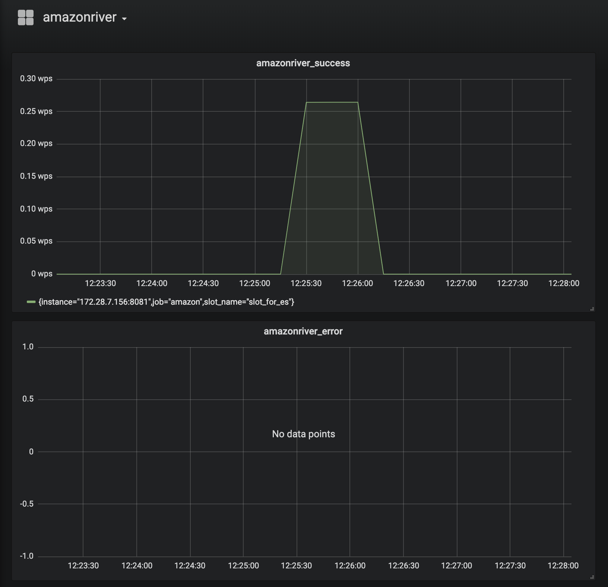

# prometheus 监控配置

## amazonriver prometheus抓取地址配置

在amazonriver的配置文件中

``` go
// PrometheusAddress prometheus
PrometheusAddress string `json:"prometheus_address"`
```

配置暴露的prometheus抓取地址,如

```json
{
    ...
    "prometheus_address":":9527",
    ...
}
```

可以通过 localhost:9527/metrics 可以获取到相关监控项

## prometheus 配置

根据文档配置yml配置文件
[如何配置](https://prometheus.io/docs/prometheus/latest/configuration/configuration/)

## 监控项

除了golang本身的监控项外，主要提供了以下的监控项。

- amazonriver_success 成功同步数据数

```
# HELP amazonriver_success success count
# TYPE amazonriver_success counter
amazonriver_success{slot_name="slot_for_es"} 14.0
```

- amazonriver_error 错误数

```
# HELP amazonriver_error error count
# TYPE amazonriver_error counter
amazonriver_error{slot_name="slot_for_es"} 14.0
```

## grafana 监控

grafana中添加

- rate(amazonriver_success[1m]) 来监控成功写入tps
- rate(amazonriver_error[1m]) 来监控错误数

